  <a href="https://github.com/GusGBalbino">
    <picture>
      <source media="(prefers-color-scheme: dark)" srcset="./assets/hero-dark.svg">
      <source media="(prefers-color-scheme: light)" srcset="./assets/hero-light.svg">
      
    </picture>
  </a>

   

  
  
  

 

  <picture>
    <source media="(prefers-color-scheme: dark)" srcset="./assets/terminal-dark.svg">
    <source media="(prefers-color-scheme: light)" srcset="./assets/terminal-light.svg">
    
  </picture>

 

  
    
  
  
  
  
  
  

 

<h3 align="center">🧪 Selected experiments</h3>

<table>
  <tr>
    <td width="50%" valign="top">
      <a href="https://github.com/GusGBalbino/Invest-Guru"><b>Invest-Guru</b></a> 
      RAG system for querying investment documents with LLMs. 
      <code>rag</code> <code>llm</code> <code>python</code>
    </td>
    <td width="50%" valign="top">
      <a href="https://github.com/GusGBalbino/mcp-challenge"><b>mcp-challenge</b></a> 
      Virtual car dealership with conversational search powered by an AI Agent + Model Context Protocol. 
      <code>agents</code> <code>mcp</code> <code>python</code>
    </td>
  </tr>
  <tr>
    <td width="50%" valign="top">
      <a href="https://github.com/GusGBalbino/leaf-disease-detector"><b>leaf-disease-detector</b></a> 
      API that detects plant leaf diseases with a Machine Learning model. 
      <code>computer-vision</code> <code>api</code>
    </td>
    <td width="50%" valign="top">
      <a href="https://github.com/GusGBalbino/hackathon-campusparty2025"><b>hackathon-campusparty2025</b></a> 
      FastAPI backend to report harassment, map risk zones and find support units, on Supabase geospatial data. 
      <code>fastapi</code> <code>supabase</code> <code>geo</code>
    </td>
  </tr>
  <tr>
    <td width="50%" valign="top">
      <a href="https://github.com/GusGBalbino/MLOps-final-work"><b>MLOps-final-work</b></a> 
      Prediction API for alcohol consumption from health data, built with an Abstract Factory pattern. 
      <code>mlops</code> <code>fastapi</code>
    </td>
    <td width="50%" valign="top">
      <a href="https://github.com/GusGBalbino/breast-tumor"><b>breast-tumor</b></a> 
      Deep Learning final project: breast tumor detection. 
      <code>deep-learning</code> <code>healthcare</code>
    </td>
  </tr>
</table>

 

  <picture>
    <source media="(prefers-color-scheme: dark)" srcset="https://raw.githubusercontent.com/GusGBalbino/GusGBalbino/output/github-snake-dark.svg">
    <source media="(prefers-color-scheme: light)" srcset="https://raw.githubusercontent.com/GusGBalbino/GusGBalbino/output/github-snake.svg">
    
  </picture>

 

  

